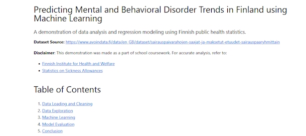
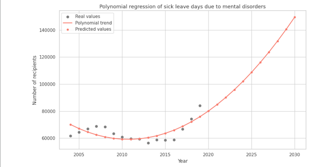
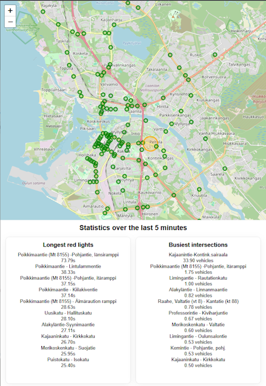

### This site serves as a assignment platform for Pilvipalvelut course, and as project portfolio thing.

# Markdown for Pilvipalvelut

> *Markdown* 

`Very cool`

~~Mmmh.~~

1. Remember
    - to
        - do

        100. homework

- [x] Bim
- [ ] Bam
- [ ] Bum :tada:

---

# [polynomial-regression-demo](https://github.com/veliok/polynomial-regression-demo)
Machine learning demo predicting sickness allowance recipients in Finland using polynomial regression.
Uses **Jupyter Notebook** and **Python** libraries.
***[Full Notebook in GitHub](https://github.com/veliok/polynomial-regression-demo/blob/main/polynomial_regression_demo.ipynb)***.

# Oulu traffic map
Leaflet.js map that indicates number of vehicles at intersections over last 5 minute interval. Colors and values might need some adjusting. Gets data from Oulun liikenne API.
***[Interactive map here](./traffic-map/traffic-map.html)***.

