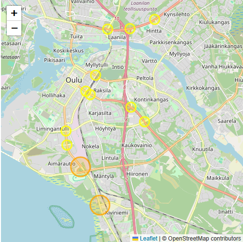
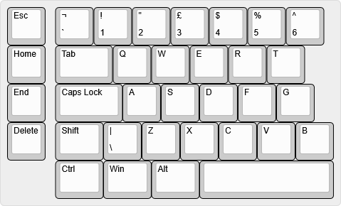
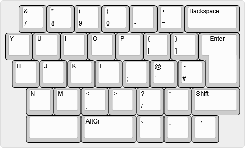

This site serves as a multiple exercise platform for Pilvipalvelut course, for now.

## Oulu traffic map


### Overview

Leaflet.js map that indicates number of vehicles at intersections in last 5 minute interval. Colors and values might need some adjusting. Gets data from Oulun liikenne API.
***[Interactive map here](./traffic-map/traffic-map.html)***.

## Discounted phones

```
Coming in near future
```

## Split keyboard

```
Work very much in progress
```

|   |  |
| ----- | ----- |
|  |  |
